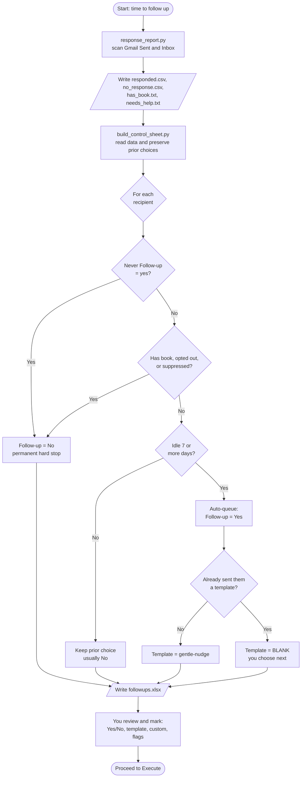
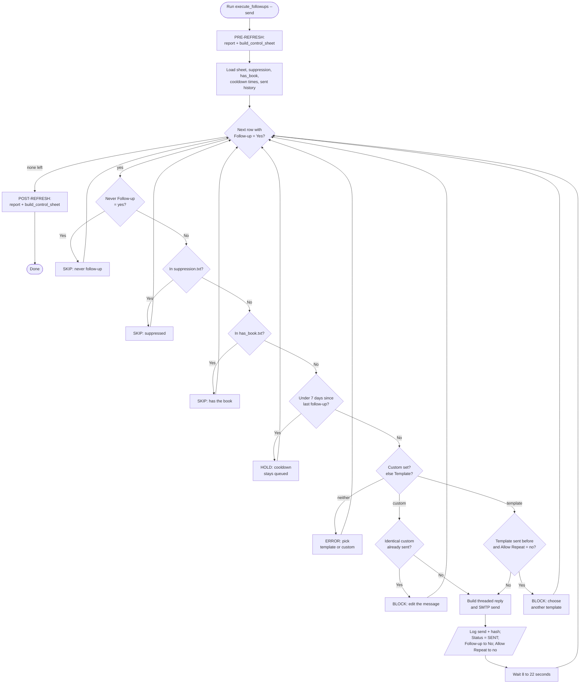
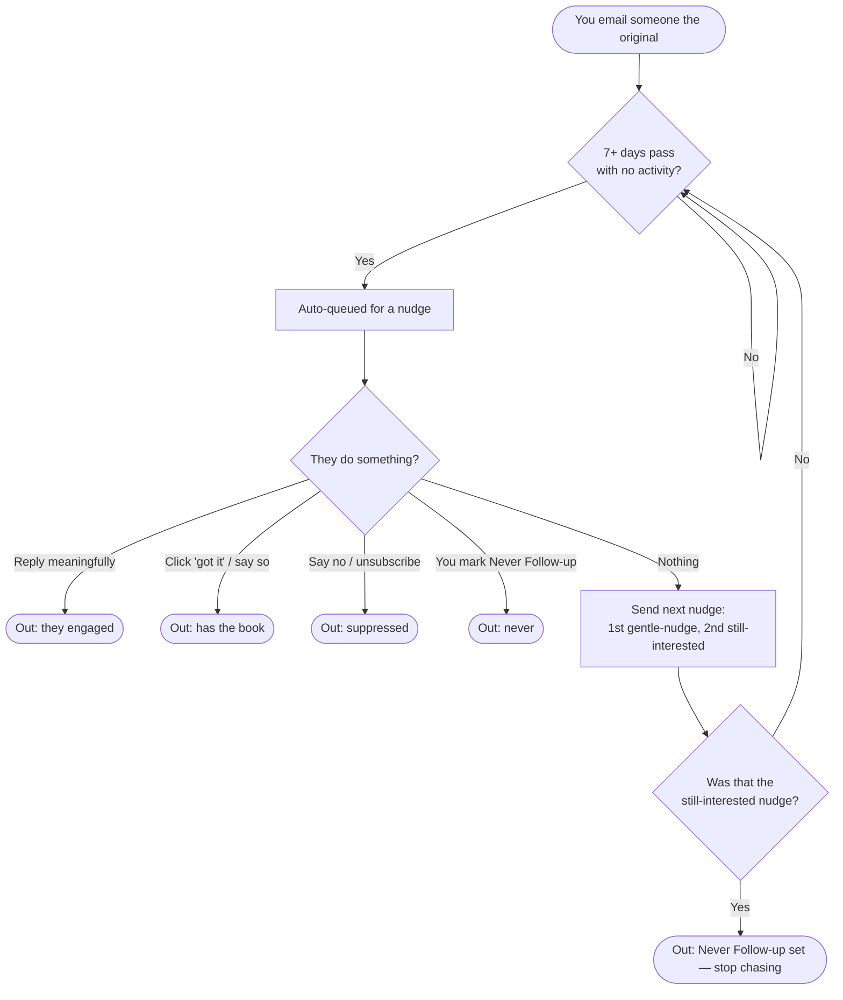

# Miner Town Follow-up Kit — Traditional Flowcharts

These are **Mermaid** flowcharts (real ovals / boxes / decision diamonds).

### How to see them as a picture
- **Easiest:** open <https://mermaid.live>, delete the sample, and paste one of
  the ```mermaid``` code blocks below — the diagram renders instantly.
- **VS Code:** install the extension *"Markdown Preview Mermaid Support"*, open
  this file, and press the Preview button (top-right).
- **GitHub:** if this repo is on GitHub, it renders automatically.

Shapes used: `([ rounded ])` = start/end · `[ box ]` = action ·
`[/ slanted /]` = file read/write · `{ diamond }` = decision.

---

## Diagram 1 — The full cycle (refresh → build → review)



---

## Diagram 2 — Execute: the per-row guardrail gate



---

## Diagram 3 — The repeating life of one recipient


